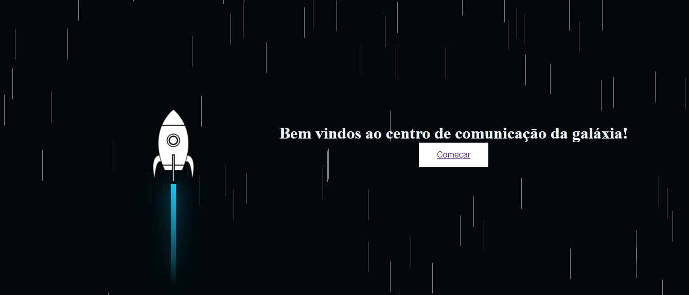
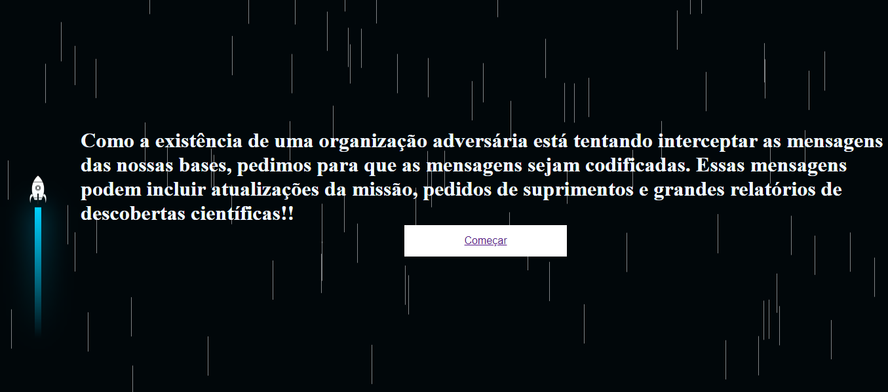
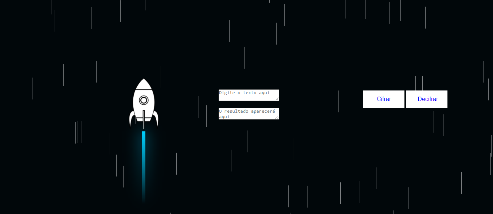

# Projeto Cipher

## Indice
- <a href = "Prefacio">Prefacio </a>
- <a href = "Prototipo">O Projeto </a>
 <a href = "Interfaces">O Projeto </a>
  <a href = "Link">O Projeto </a>

## Prefacio
A cifra de César, também conhecida como cifra de deslocamento, é uma das mais simples e conhecidas técnicas de criptografia. É um tipo de cifra de substituição na qual cada caractere no texto original é 'deslocado' um certo número de lugares abaixo ou acima no alfabeto.
Por exemplo, com um deslocamento de 3, a letra A seria substituída por D, B se tornaria E e assim por diante. A razão para o nome é que esta cifra foi supostamente usada por Júlio César para comunicar-se com seus generais.
Aqui está um exemplo de como "HELLO" seria codificado usando a cifra de César com um deslocamento de 3:
H -> K
E -> H
L -> O
L -> O
O -> R
Portanto, "HELLO" se torna "KHOOR".

## O Projeto
O projeto foi criado para que astronautas podessem se comunicar com textos criptografados, o que dificultaria qualquer intecorrencia, alem de manter a confidencialidade da conversa.

## Prototipo
O prototipo foi separado em três paginas, a primeira é uma pagina para apresentação inicial ao usuario.

A segunda fala sobre qual é a proposta de conversa que deve ser abordada durante a utilização da Cifra de Cesar.

A terceira é a pagina onde acontece o processo de cripitografia e descriptografia do texto informado pelo usuario.

## Interfaces

## Link
